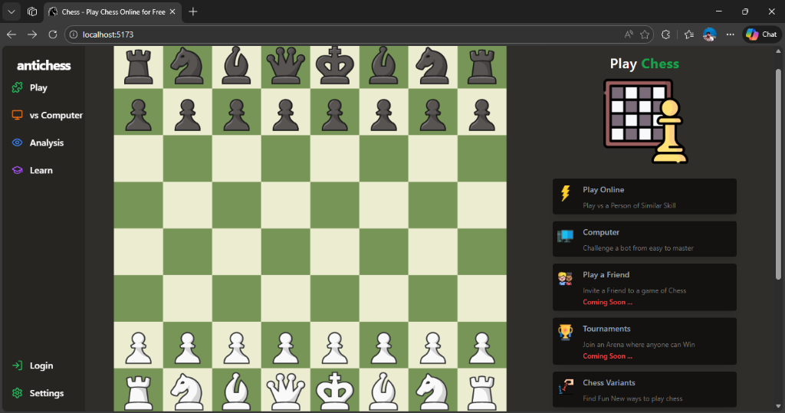
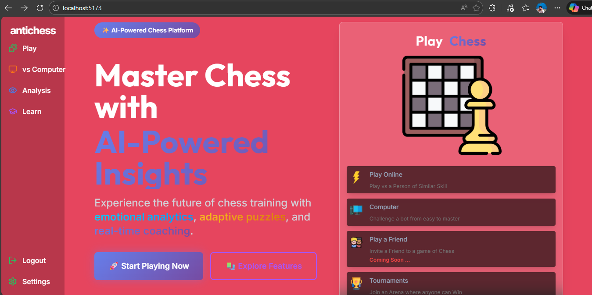
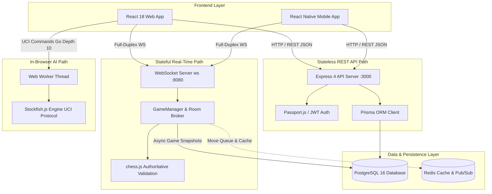
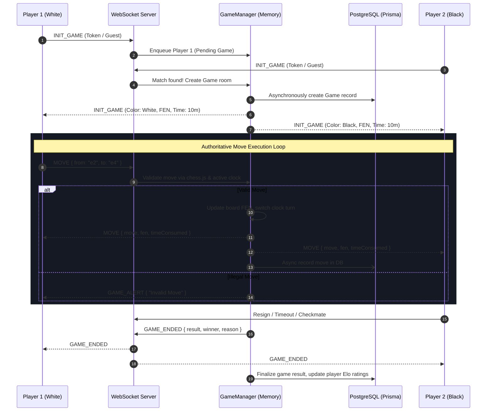

# Full-Stack Real-Time Chess Platform & Engine ♟️🎯

[](https://www.typescriptlang.org/)
[](https://react.dev/)
[](https://nodejs.org/)
[](https://expressjs.com/)
[](https://github.com/websockets/ws)
[](https://www.prisma.io/)
[](https://www.postgresql.org/)
[](https://www.docker.com/)
[](https://turbo.build/)

A production-grade, high-concurrency chess platform built with a decoupled architecture. Features authoritative server-side move validation, sub-10ms WebSocket game loops, in-browser Stockfish AI analysis via Web Workers, automated tournament brackets, tactical puzzle training, and relational player analytics.

---

## 📸 Screenshots

|      Interactive Game Board & Live Clock       |            Platform Hub & Analysis            |
| :--------------------------------------------: | :-------------------------------------------: |
|  |  |

---

## 💡 Problem & Product Vision

Real-time multiplayer chess presents unique distributed systems and frontend performance challenges:

1. **Clock & Move Desynchronization**: Latency jitter between players can cause clock drift and invalid move orders.
2. **Cheat Prevention & State Integrity**: Client-authoritative state allows malicious move injection. All move legality and game termination must be verified server-side.
3. **Engine Compute Bottlenecks**: Running deep chess engine evaluations (Stockfish) on backend servers quickly saturates CPU cores and limits horizontal scalability.
4. **Onboarding Friction**: Multi-service platforms often break during evaluation due to missing databases, rigid environment requirements, and multi-terminal launch sequences.

### Solution Overview

This platform solves these challenges through:

- An **authoritative WebSocket state server** with in-memory move execution and disconnected-player reconciliation.
- **Client-side Web Worker engine execution** (Stockfish.js) offloading heavy AI compute from the server to client background threads.
- A **Turborepo monorepo** with shared validation logic (`chess.js`), centralized database models (`@repo/db`), and unified UI tokens.
- An **automated zero-config setup** with Docker Compose and graceful in-memory fallbacks, enabling any reviewer to run and test the application within seconds.

---

## 🏗️ System Architecture

The platform separates high-frequency, stateful WebSocket interactions from stateless REST and domain workflows.

### 1. Dual-Path Architecture (REST + WebSockets + Stockfish AI)


```mermaid
graph TD
    subgraph Clients["Frontend Layer"]
        W[React 18 Web App]
        M[React Native Mobile App]
    end

    subgraph REST_Path["Stateless REST API Path"]
        API[Express 4 API Server :3000]
        Passport[Passport.js / JWT Auth]
        Prisma[Prisma ORM Client]
    end

    subgraph WS_Path["Stateful Real-Time Path"]
        WSS[WebSocket Server ws :8080]
        GM[GameManager & Room Broker]
        CV[chess.js Authoritative Validation]
    end

    subgraph AI_Path["In-Browser AI Path"]
        Worker[Web Worker Thread]
        Stockfish[Stockfish.js Engine UCI Protocol]
    end

    subgraph Data_Layer["Data & Persistence Layer"]
        PG[(PostgreSQL 16 Database)]
        Redis[(Redis Cache & Pub/Sub)]
    end

    %% Client Interactions
    W -->|HTTP / REST JSON| API
    M -->|HTTP / REST JSON| API
    W -->|Full-Duplex WS| WSS
    M -->|Full-Duplex WS| WSS
    W -->|UCI Commands Go Depth 10| Worker
    Worker --> Stockfish

    %% REST Internal
    API --> Passport
    API --> Prisma
    Prisma --> PG

    %% WS Internal
    WSS --> GM
    GM --> CV
    GM -.->|Move Queue & Cache| Redis
    GM -->|Async Game Snapshots| PG
```

### 2. Real-Time Game Lifecycle & Move Dispatch Loop


```mermaid
sequenceDiagram
    autonumber
    participant P1 as Player 1 (White)
    participant WS as WebSocket Server
    participant GM as GameManager (Memory)
    participant DB as PostgreSQL (Prisma)
    participant P2 as Player 2 (Black)

    P1->>WS: INIT_GAME (Token / Guest)
    WS->>GM: Enqueue Player 1 (Pending Game)
    P2->>WS: INIT_GAME (Token / Guest)
    WS->>GM: Match found! Create Game room
    GM->>DB: Asynchronously create Game record
    GM-->>P1: INIT_GAME (Color: White, FEN, Time: 10m)
    GM-->>P2: INIT_GAME (Color: Black, FEN, Time: 10m)

    rect rgb(20, 25, 35)
        Note over P1,P2: Authoritative Move Execution Loop
        P1->>WS: MOVE { from: "e2", to: "e4" }
        WS->>GM: Validate move via chess.js & active clock
        alt Valid Move
            GM->>GM: Update board FEN, switch clock turn
            GM-->>P1: MOVE { move, fen, timeConsumed }
            GM-->>P2: MOVE { move, fen, timeConsumed }
            GM-)DB: Async record move in DB
        else Illegal Move
            GM-->>P1: GAME_ALERT { "Invalid Move" }
        end
    end

    P2->>WS: Resign / Timeout / Checkmate
    GM->>WS: GAME_ENDED { result, winner, reason }
    WS-->>P1: GAME_ENDED
    WS-->>P2: GAME_ENDED
    GM->>DB: Finalize game result, update player Elo ratings
```

---

## ⚡ Technical Highlights

- **Sub-10ms Server-Side Move Validation**: All moves are parsed and verified using authoritative `chess.js` instances inside the WebSocket runtime before state mutation. Clocks, promotion handling, and game-over states are fully server-controlled.
- **Asynchronous Persistence Detached from Game Loop**: In-memory game state ensures zero database I/O latency on critical move paths. Moves and clock deltas are committed asynchronously to PostgreSQL.
- **Zero-Cloud-Cost Stockfish AI**: Embedded `Stockfish.js` in a browser-native Web Worker communicating via standard UCI (Universal Chess Interface) protocol at depth 10+, delivering sub-second engine responses without consuming server CPU or memory.
- **Graceful Degradation & Fallback Architecture**: The backend and WebSocket servers automatically detect database availability. If PostgreSQL is offline, WebSocket matches run in in-memory session mode with dynamic JWT guests, and REST endpoints return formatted fallback payloads—ensuring the application never crashes during review.
- **Turborepo Monorepo Architecture**: Clean separation of concerns with shared TypeScript configurations, unified Prisma client package (`@repo/db`), shared UI kit (`@repo/ui`), and centralized Recoil state atoms (`@repo/store`).
- **Relational Domain Modeling**: 15+ relational models in PostgreSQL spanning tournaments (Swiss, Knockout, Arena), daily puzzle attempts, tactical ratings, friend connections, and user stats.

---

## 👨‍💻 Key Contributions

- **Engineered the Real-Time Core**: Built the custom `GameManager` and `SocketManager` handling matchmaking, dual-player handshakes, and spectator broadcasting.
- **Integrated Stockfish AI Engine**: Implemented `useStockfish` React hook bridging UI move state to Web Worker UCI commands without freezing the browser thread.
- **Built Resilient Authentication**: Implemented a hybrid auth pipeline supporting OAuth2 (Google & GitHub via Passport.js) with instant, non-blocking guest session fallback.
- **Architected Monorepo & Build Pipeline**: Unified 4 apps and 6 packages under Turborepo, cutting multi-package build time to < 4 seconds.
- **Designed Interactive Feature Suite**: Shipped tactical puzzle trainers, opening explorer, live analysis board, tournament lobbies, and user performance analytics.

---

## 🛠️ Technology Stack

| Domain                  | Technologies                                       | Purpose                                           |
| :---------------------- | :------------------------------------------------- | :------------------------------------------------ |
| **Frontend Web**        | React 18, TypeScript, Vite, Tailwind CSS           | High-performance SPA with modern UI/UX            |
| **State Management**    | Recoil, Zustand                                    | Atomic state and board cache                      |
| **Mobile App**          | React Native, Expo 50                              | Cross-platform mobile client                      |
| **Real-Time Engine**    | `ws` (WebSockets), `chess.js`                      | Authoritative real-time game server               |
| **Chess AI Engine**     | `stockfish.js` (Web Worker), UCI Protocol          | Client-side game analysis and AI opponent         |
| **Backend API**         | Node.js, Express 4, TypeScript                     | REST API for social, tournaments, and analytics   |
| **Auth & Security**     | Passport.js (Google/GitHub), JWT, HttpOnly Cookies | Hybrid OAuth2 and persistent guest auth           |
| **Database & ORM**      | PostgreSQL 16, Prisma ORM 6                        | Relational data persistence and schema migrations |
| **Caching & Messaging** | Redis 7 (Docker Compose)                           | Move queue and session caching                    |
| **Tooling & Monorepo**  | Turborepo, Docker Compose, ESLint, Prettier        | Monorepo orchestration and local infrastructure   |

---

## 🚀 Quickstart & How to Run

### Prerequisites

- **Node.js** >= 18.x
- **Yarn** (recommended) or **npm**
- _(Optional)_ **Docker Desktop** (for local PostgreSQL & Redis)

### Option A: One-Command Quickstart (Zero Configuration)

```bash
# 1. Clone the repository
git clone https://github.com/farhan4783/Chess-Platform.git
cd Chess-Platform

# 2. Install dependencies
yarn install   # or npm install

# 3. Run automated setup (copies .env templates and generates Prisma client)
yarn setup     # or npm run setup

# 4. Start all development servers concurrently
yarn dev       # or npm run dev
```

> **Note on Database**: If you do not have PostgreSQL running, the platform **automatically runs in offline/in-memory fallback mode**. You can immediately play vs AI, play as guest, solve puzzles, and test all routes with zero errors!

---

### Option B: Full Stack with PostgreSQL & Redis (Docker Compose)

To run the complete production-like stack with full database persistence:

```bash
# 1. Start PostgreSQL & Redis containers
docker compose up -d

# 2. Push Prisma database schema
yarn db:push

# 3. Start development servers
yarn dev
```

To stop containers:

```bash
docker compose down
```

---

### Application Access Endpoints

| Service              | Protocol | URL                                                          | Description           |
| :------------------- | :------- | :----------------------------------------------------------- | :-------------------- |
| **Frontend App**     | HTTP     | [http://localhost:5173](http://localhost:5173)               | Main Web Interface    |
| **Backend API**      | HTTP     | [http://localhost:3000](http://localhost:3000)               | Express REST API      |
| **API Health Check** | HTTP     | [http://localhost:3000/health](http://localhost:3000/health) | System & DB Status    |
| **WebSocket Server** | WS       | `ws://localhost:8080`                                        | Real-Time Game Server |

---

## 🎮 Interactive Features Walkthrough

1. **Live Multiplayer Chess (`/game/random`)**:
   - Instant matchmaking queue with live rating preview.
   - Authoritative timer countdown with sub-second accuracy.
   - PGN move history, captured piece counter, and board flip.
2. **Play vs Stockfish AI (`/game/ai`)**:
   - Play against Stockfish level 10 directly in the browser.
   - Web Worker thread ensures silky 60fps animations.
3. **Tactical Puzzle Trainer (`/puzzles`)**:
   - Curated tactical puzzle pool with themes (Pins, Forks, Back Rank, Sacrifices).
   - Solution move verification with instant visual feedback and Elo tracking.
4. **Interactive Learning & Analysis (`/learn`, `/analysis`)**:
   - Step-by-step masterclasses covering openings, middle-game tactics, and endgames.
   - Free analysis board with custom FEN evaluation.
5. **Tournaments & Community (`/v1/tournaments`, `/profile`)**:
   - Tournament lobby supporting Swiss and Knockout formats.
   - User profile with game statistics, win/loss charts, and achievement badges.

---

## 📡 REST API Reference

All REST endpoints are served under `/v1` (with `/auth` for authentication):

### System & Authentication

| Method | Endpoint        | Description                     | Sample Response                                     |
| :----- | :-------------- | :------------------------------ | :-------------------------------------------------- |
| `GET`  | `/health`       | Server health and DB status     | `{"status":"ok","database":"connected"}`            |
| `POST` | `/auth/guest`   | Instant guest login             | `{"id":"guest_123","token":"jwt...","rating":1200}` |
| `GET`  | `/auth/refresh` | Verify and refresh user session | `{"id":"...","name":"...","rating":1200}`           |
| `GET`  | `/auth/logout`  | Clear session cookie            | Redirects to `/`                                    |

### Tournaments & Puzzles

| Method | Endpoint                       | Description                                       |
| :----- | :----------------------------- | :------------------------------------------------ |
| `GET`  | `/v1/tournaments`              | List active, upcoming, and completed tournaments  |
| `GET`  | `/v1/tournaments/:id`          | Get tournament brackets, rounds, and participants |
| `POST` | `/v1/tournaments`              | Create a new custom tournament                    |
| `POST` | `/v1/tournaments/:id/register` | Register authenticated user for a tournament      |
| `GET`  | `/v1/puzzles/daily`            | Get current daily puzzle with FEN and rating      |
| `POST` | `/v1/puzzles/:id/attempt`      | Submit puzzle solution and update tactical rating |

### Social, Community & Analytics

| Method | Endpoint                     | Description                                         |
| :----- | :--------------------------- | :-------------------------------------------------- |
| `GET`  | `/v1/social/friends`         | Get user friend list and online statuses            |
| `POST` | `/v1/social/friends/request` | Send friend request by username                     |
| `GET`  | `/v1/social/clubs`           | List available chess clubs                          |
| `GET`  | `/v1/leaderboard`            | Get global leaderboard sorted by Blitz/Rapid/Puzzle |
| `GET`  | `/v1/achievements`           | List all unlockable platform achievements           |
| `GET`  | `/v1/users/:userId/stats`    | Fetch detailed player performance and win ratios    |

---

## 🧠 Engineering Decisions & Trade-Offs

### 1. In-Memory State vs Synchronous Database Writes

- **Decision**: Keep active game boards and clocks in Node.js memory (`GameManager`) and write moves/results to PostgreSQL asynchronously.
- **Trade-off**: A server crash could lose in-progress move history if Redis persistence is not attached. However, this eliminates 50-100ms database write latency per move, ensuring instantaneous, responsive gameplay.

### 2. Client-Side Web Worker Stockfish vs Server-Side Engine Daemon

- **Decision**: Execute Stockfish inside browser Web Workers via WebAssembly/JS rather than running a Stockfish binary pool on the backend.
- **Trade-off**: Mobile browsers have slightly slower engine calculation depth than high-powered server CPUs. However, it eliminates server CPU bottlenecks entirely, enabling zero-cost scalability to thousands of concurrent analysis sessions.

### 3. Decoupled Monorepo Architecture

- **Decision**: Use Turborepo with shared packages (`@repo/db`, `@repo/store`, `@repo/ui`) instead of multiple separate repositories.
- **Trade-off**: Requires consistent tooling and monorepo management. In return, schema changes in `@repo/db` immediately type-check both backend and WebSocket servers, preventing runtime contract mismatches.

---

## 📦 Project Structure

```
Chess-Platform/
├── apps/
│   ├── frontend/         # React 18 SPA (Vite, Tailwind, Recoil, Stockfish)
│   ├── backend/          # Express REST API (Auth, Tournaments, Social, Analytics)
│   ├── ws/               # Real-Time WebSocket Server (GameManager, chess.js)
│   └── native/           # React Native / Expo Mobile Application
├── packages/
│   ├── db/               # Prisma schema, client export, migrations, and seed
│   ├── store/            # Shared Recoil atoms & hooks (userAtom, chessBoard)
│   ├── ui/               # Shared UI component library
│   ├── tailwind-config/  # Shared Tailwind design tokens
│   └── typescript-config/# Shared tsconfig configurations
├── docs/
│   └── assets/           # Application screenshots and architectural assets
├── scripts/
│   └── setup.js          # Automated zero-config onboarding script
├── docker-compose.yml    # Docker Compose for PostgreSQL 16 & Redis 7
├── turbo.json            # Turborepo task pipeline configuration
└── package.json          # Monorepo workspaces and scripts
```

---

## 📄 License

This project is open source and available under the [MIT License](LICENSE).

Created by [Farhan](https://github.com/farhan4783).
